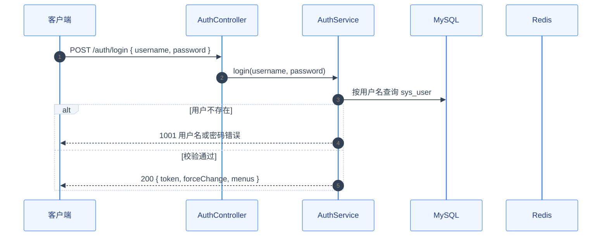
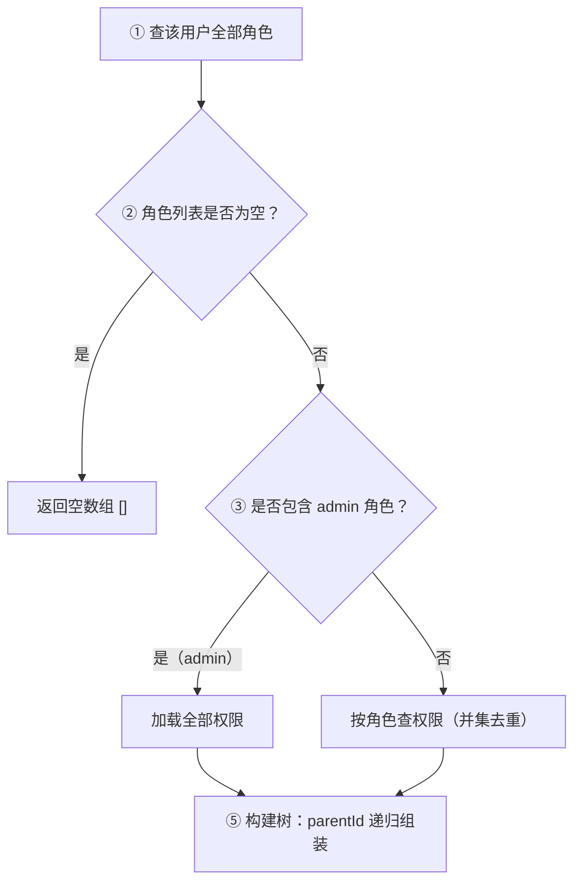

# 中间产物 Markdown 样式规范

> 使用说明：**生成任何中间产物 md（功能清单 / 澄清清单 / 项目约束 / 技术方案 / 任务拆解 / 验收报告）时必须遵守本文档**，保证文档精美、专业、可读。
> 目标观感：像开源项目技术文档（GitHub README 级）——速览框、对齐表格、配色时序图/流程图、状态徽标、完成自检。

---

## 一、通用样式规则

### 1.1 文档头部：速览框（所有产物必有）

用 GitHub 官方 callout（`> [!IMPORTANT]`）放关键信息速览表，一屏看懂文档主题。

```markdown
> [!IMPORTANT] 文档速览
>
> | 项目 | 内容 |
> | :--- | :--- |
> | **模块** | 订单管理 |
> | **功能项** | #1 订单创建 · #2 订单查询 |
> | **类型** | Controller |
> | **优先级** | P1 |
> | **依赖** | #3 权限初始化 |
```

- 固定用 `> [!IMPORTANT]` + 标题「文档速览」
- 速览表 2 列：`项目` / `内容`，右列关键值用 `**加粗**`
- 表头列宽不强制，Markdown 渲染自动对齐；分隔行统一 `:---`

### 1.2 分区：用 `---` 分隔大章节

每个 `##` 大章节之间插入 `---` 水平线，增强视觉层次：

```markdown
## 一、入口定义 → 接口清单

...

---

## 二、数据契约 → 入参出参 JSON + 校验规则
```

### 1.3 表格：统一对齐 + 表头加粗 + 序号列居中

| 场景 | 对齐方式 | 分隔行写法 |
| :--- | :--- | :--- |
| 文本列（名称/路径/说明） | 左对齐 | `:---` |
| 编号列（# / 序号） | 居中 | `:---:` |
| 数值列（错误码/数量） | 居中 | `:---:` |
| 短状态列（✅/❌/P1） | 居中 | `:---:` |

```markdown
| # | 接口 | 错误码 | 说明 |
| :---: | :--- | :---: | :--- |
| 1 | POST /order | 400 / 500 | 创建订单 |
```

- **表格必须有分隔行对齐标记**，禁止裸 `---|---`（渲染会左对齐难看）
- 表头用普通文本即可，Markdown 表头自动加粗
- 表格内容超过一屏的，拆成多张语义子表（按场景/按模块），避免超长表

### 1.4 callout 提示框（区分信息级别）

| 语法 | 用途 | 视觉 |
| :--- | :--- | :--- |
| `> [!NOTE]` | 补充说明 / 覆盖口径 | 蓝 |
| `> [!TIP]` | 复用建议 / 优化建议 | 绿 |
| `> [!IMPORTANT]` | 必须注意 / 关键约束 | 紫 |
| `> [!WARNING]` | 高风险 / 易错点 | 黄 |
| `> [!CAUTION]` | 不可违背 / 危险操作 | 红 |

```markdown
> [!WARNING] 强制改密拦截
> forceChange = 1 的用户访问受保护接口返回 1007。
```

- 仅内容重要才用，滥用会稀释信息密度
- 短内容直接 callout 单行 + 标题；长内容标题 + 列表/表格

### 1.5 状态徽标（进度 / 状态列）

| 状态 | 标记 |
| :--- | :--- |
| 已确认 / 通过 / 已处理 | `✅` |
| 未确认 / 失败 / 待处理 | `❌` |
| 待确认 / 进行中 | `🔲` / `🟡` |
| 不适用 / 跳过 | `—` |

统一用 emoji，不用文字「已完成/未完成」混搭。

### 1.6 完成标准自检（每个产物末尾）

```markdown
## 完成标准自检

- [x] 接口清单完整，无"待定"
- [ ] 验收场景三态覆盖（合法 / 非法 / 边界）
```

- 完成的 `[x]`，未完成 `[ ]`
- 逐条对照，禁止整段复制不核对

---

## 二、技术方案专属样式（mermaid 图）

### 2.1 时序图（sequenceDiagram）——核心逻辑必配

用 mermaid 时序图表达「调用方 → 服务 → DB/Redis/外部」交互，配色走统一主题变量。



**时序图规则**：
- 第一行 init 主题变量**逐字使用上方配置**（统一配色，禁止自创颜色）
- `autonumber` 自动编号；参与者别名用**中文业务名**（`C as 客户端`）
- 用 `alt / else / end` 表达分支；`rect` 表达并行区（如需）
- 关键消息写清路径与入参；响应消息标注状态码与关键字段
- 图后紧跟「**处理步骤**」编号列表，图 + 步骤配套，图给直觉、步骤给细节

### 2.2 流程图（flowchart）——复杂决策 / 状态流转必配



**流程图规则**：
- 第一行 init 主题变量**逐字使用上方配置**
- 节点文字带 `① ② ③` 序号 + 中文描述，与「处理步骤」编号对应
- 决策节点（菱形）用 `{"..."}`；分支标签写明判定条件（`|"是"|`）
- 复杂分支图放「业务规则」小节；简单流程不必画图（避免过度）

### 2.3 mermaid 渲染注意

- **渲染器要求**：GitHub / GitLab / Obsidian / VSCode 均原生支持 mermaid，直接写代码块即可
- 若目标平台不支持 mermaid（如某些 IDE 纯文本），**保留图的同时必须保留「处理步骤」编号列表**——图是增强，步骤是兜底
- 图内禁止超长句子（一行 ≤ 40 字符），长描述放图下步骤

---

## 三、各产物速览表模板（直接套用）

### 3.1 功能清单速览

```markdown
> [!IMPORTANT] 文档速览
>
> | 项目 | 内容 |
> | :--- | :--- |
> | **模块** | 订单管理 |
> | **功能项数** | 8（Controller 5 · Listener 1 · Job 2） |
> | **优先级分布** | P1×6 · P2×2 |
> | **依赖** | 见功能清单依赖列 |
```

### 3.2 澄清清单速览

```markdown
> [!IMPORTANT] 文档速览
>
> | 项目 | 内容 |
> | :--- | :--- |
> | **澄清对象** | 订单管理功能清单 |
> | **问题总数** | 8（已确认 5 · 待确认 3） |
> | **阻塞项** | 2（见下方 🔲 项） |
```

### 3.3 任务拆解速览

```markdown
> [!IMPORTANT] 文档速览
>
> | 项目 | 内容 |
> | :--- | :--- |
> | **任务总数** | 10 |
> | **Phase 分布** | 0×2 · 0.5×2 · 1×1 · 2×2 · 3×1 · 4×1 · 5×1 |
> | **契约测试** | T005（先红后绿） |
> | **公共组件** | T003 XxxUtil / T004 AbstractXxx |
```

### 3.4 验收报告速览

```markdown
> [!IMPORTANT] 文档速览
>
> | 项目 | 内容 |
> | :--- | :--- |
> | **功能** | 订单创建（US-001） |
> | **测试** | 12 通过 / 0 失败 |
> | **差异数** | 3（已处理 2 · 待处理 1） |
> | **结论** | 待处理差异 → 追加任务 |
```

---

## 四、风格红线（禁止）

| 红线 | 反例 | 正例 |
| :--- | :--- | :--- |
| 裸表格无对齐标记 | `\|--\|--\|` | `\| :---: \| :--- \|` |
| 长表格不拆 | 一张 30 行表格 | 按语义拆 3 张 |
| 无速览框 | 直接 `## 功能清单` | 先 `> [!IMPORTANT]` 速览 |
| 无时序图 | 核心逻辑只有文字 | mermaid 时序图 + 步骤 |
| 自创配色 | `themeVariables` 乱改 | 逐字使用上方两套配置 |
| callout 滥用 | 每段都套 IMPORTANT | 仅重要内容 |
| 状态用文字 | 「已完成」 | `✅` |

## 自检清单

- [ ] 文档开头有 `> [!IMPORTANT]` 速览框
- [ ] 大章节之间用 `---` 分隔
- [ ] 所有表格分隔行带对齐标记（`:---` / `:---:`）
- [ ] 技术方案核心逻辑含 mermaid 时序图（配色用统一主题变量）+ 处理步骤编号列表
- [ ] 复杂决策/状态流转含 mermaid 流程图
- [ ] 状态列用 emoji（✅ / ❌ / 🔲），不用文字混搭
- [ ] 末尾完成标准自检逐条核对
- [ ] 无超长表格 / 无自创配色 / 无 callout 滥用
