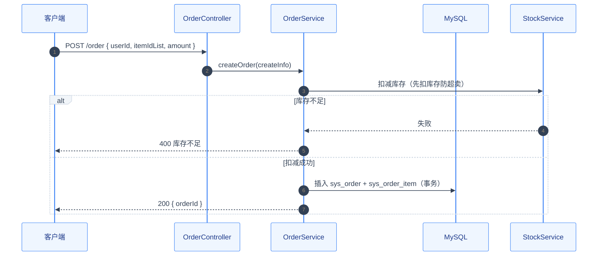

# 技术方案：Controller 类型模板（同步 HTTP）

> 使用说明：这是第 ③ 步技术方案的**类型模板**（Controller，同步请求-响应）。
> 与 `3.0-技术方案-通用骨架.md` 配套使用：**方案 = 3.0 通用骨架 + 本模板四段内容**。
> 本文件只含类型特有内容，不含通用章节。下方示例（用户管理）展示四段填充后的完整形态。
>
> 📌 **样式要求**：速览框 / 对齐表格 / mermaid 配色统一按 `00-中间产物-MD样式规范.md`。

## 四段式内容（并入 3.0 骨架，本类型必填）

### 一、入口定义 → 接口清单

| # | 方法 | 路径 | 入参 | 出参 | 对应 Service | 错误码 |
| :---: | :---: | :--- | :--- | :--- | :--- | :--- |
| 1 | POST | /system/user | UserDTO | `Response<UserVO>` | UserService.createUser | 400/409/500 |
| 2 | GET | /system/user/{id} | id (Long) | `Response<UserVO>` | UserService.getUserById | 404/500 |
| 3 | GET | /system/user/list | UserQueryDTO | `Response<PageResult<UserVO>>` | UserService.pageUsers | 400/500 |
| 4 | PUT | /system/user | UserDTO | `Response<Void>` | UserService.updateUser | 400/404/500 |
| 5 | DELETE | /system/user/{ids} | ids (Long[]) | `Response<Void>` | UserService.deleteUsers | 400/404/500 |

> [!NOTE] 返回体
> 统一返回体 `Response<T>`（code/message/data），分页用 `PageResult<T>`；禁止 `R` / `Map` 裸返回（见 java-code-standards 命名规范）。

### 二、数据契约 → 入参出参 JSON + 校验规则

**入参示例（请求体 JSON）**：

```json
// POST /system/user  创建用户
{
  "username": "zhangsan",
  "nickname": "张三",
  "email": "zhangsan@example.com",
  "phone": "13800138000",
  "password": "abc123456",
  "deptId": 101,
  "roleIdList": [1, 2],
  "status": "0"
}
```

**出参示例（成功 / 失败 / 分页）**：

```json
// 成功
{ "code": 200, "message": "操作成功", "data": { "userId": 10001, "username": "zhangsan" } }
// 失败
{ "code": 409, "message": "用户名已存在", "data": null }
// 分页
{ "code": 200, "message": "操作成功", "data": { "total": 1, "rows": [ { "userId": 10001, "username": "zhangsan", "status": "0" } ] } }
```

**校验规则（必填/格式/长度/枚举/唯一，逐字段）**：

| DTO | 字段 | 必填 | 校验规则 | 失败返回 |
| :--- | :--- | :---: | :--- | :--- |
| UserDTO | username | 是 | 3-30 字符，唯一 | 400 / 409 |
| UserDTO | email | 是 | 邮箱格式 `^[a-zA-Z0-9._%+-]+@[a-zA-Z0-9.-]+\.[a-zA-Z]{2,}$` | 400 |
| UserDTO | password | 是 | 8-20 位，含字母和数字 | 400 |
| UserDTO | status | 是 | 枚举 "0"正常 / "1"停用 | 400 |
| UserQueryDTO | pageNum/pageSize | 否 | 默认 1/10，pageSize ≤ 100 | 400 |

### 三、核心逻辑 → Service 业务逻辑（按第零段复杂度判定分档）

- **简单转发**（纯 CRUD，单表）→ 注明"纯转发"，本节跳过
- **复杂业务**（多表写 / 状态流转 / 算法 / 并发）→ **必写业务规则小节**：

**示例（订单创建）：**



**处理步骤**：

1. 先扣库存再建订单（防超卖窗口）
2. `@Transactional` 包裹多表写入：sys_order + sys_order_item
3. 返回订单号

- **状态流转**：如 `PENDING → PAID → SHIPPED → COMPLETED`（谁触发 / 非法流转拦截）
- **计算规则**：如金额 = Σ(单价×数量) − 折扣 + 运费，精度 DECIMAL(10,2)
- **并发处理**：如先扣库存再建订单（防超卖窗口）、乐观锁 / 分布式锁

### 四、关注点 → 权限与事务

| 关注点 | 要求 |
| :--- | :--- |
| 权限 | 全部接口 `@RequiresPermission`：POST/PUT/DELETE → `system:user:edit`；GET → `system:user:query` |
| 事务 | createUser / deleteUsers / updateUser：多表写 → `@Transactional`（只放 Service 层） |
| 异常 | Controller 不 try/catch，统一全局处理器转换 |

> [!WARNING] 权限与事务边界
> 权限注解必须对照《项目约束》权限章节逐接口核对；事务只放 Service 层，禁止 Controller 层 `@Transactional`。

## 完整示例（用户管理 —— 四段 + 通用章节合并后的形态）

> 示例展示"3.0 骨架 + 本模板"合并后的完整方案：**验收场景/公共组件识别/注释要求见 3.0 通用章节**，此处只展示四段在方案中的呈现。

```markdown
# 技术方案：用户管理（US-001）

> [!IMPORTANT] 文档速览
>
> | 项目 | 内容 |
> | :--- | :--- |
> | **功能项** | #1 用户管理 |
> | **模块类型** | Controller |
> | **优先级** | P1 |

## 验收场景（通用章节，合法+非法+边界）
| # | 类别 | 场景 | 请求 | 期望 |
| :---: | :---: | :--- | :--- | :--- |
| 1 | 合法 | 创建成功 | 合法入参 | 200 + data.userId 存在 |
| 2 | 非法 | 用户名重复 | 已存在的 username | 409 + "用户名已存在" |
| 3 | 非法 | 邮箱格式非法 | email="abc" | 400 + 参数校验错误 |
| 4 | 边界 | 查询不存在 | id=99999 | 404 + "用户不存在" |
| 5 | 边界 | 未授权 | 无 token 请求 | 403 |

## 公共组件识别（通用章节）
| # | 重复/可复用逻辑 | 使用点 | 抽取类型 | 设计 |
| :---: | :--- | :--- | :--- | :--- |
| 1 | 用户状态校验（存在+启用） | 接口 2/3/5 | 工具类 common/util/UserValidator | UserValidator.existsAndEnabled(userId) |

## 一、入口定义 → 接口清单
（见本模板四段第一节，5 个接口表格）

## 二、数据契约 → 入参出参 + 校验
（见本模板四段第二节）

## 三、核心逻辑 → Service 业务逻辑
（见本模板四段第三节：mermaid 时序图 + 处理步骤；复杂业务写状态流转/计算规则/并发处理）

## 四、关注点 → 权限与事务
（见本模板四段第四节）

## 注释要求（通用章节）
- 每个接口 Javadoc：功能说明、入参、出参、异常
```

## 类型特有自检（并入 3.0 完成标准后勾选）

- [ ] 接口清单完整：方法/路径/入参/出参/对应 Service/错误码，无"待定"
- [ ] 每个接口有入参 + 出参 JSON 示例（成功/失败/分页）
- [ ] 校验规则覆盖必填/格式/长度/枚举/唯一
- [ ] 数据模型 DDL 完整（表 + 关联表 + 索引 + 查询 SQL）
- [ ] 权限注解 + 事务边界已写明（对照项目约束）
- [ ] 复杂业务已写业务规则（mermaid 时序图 + 处理步骤 + 状态流转/计算规则/并发处理）；简单转发已注明"纯转发"
