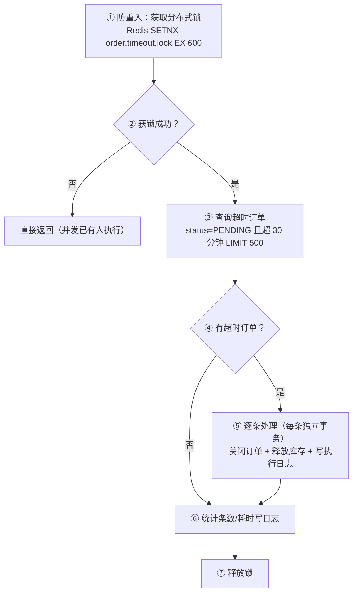

# 技术方案：Job 类型模板（定时触发）

> 使用说明：这是第 ③ 步技术方案的**类型模板**（Job，定时任务）。
> 与 `3.0-技术方案-通用骨架.md` 配套使用：**方案 = 3.0 通用骨架 + 本模板四段内容**。
> 防重入和批处理是 Job 的**生死线**——并发触发、长事务、单条失败拖垮批量必须在方案里写死。
> 本文件只含类型特有内容，不含通用章节。
>
> 📌 **样式要求**：速览框 / 对齐表格 / mermaid 配色统一按 `00-中间产物-MD样式规范.md`。

## 四段式内容（并入 3.0 骨架，本类型必填）

### 一、入口定义 → 调度配置

| 配置项 | 值 |
| :--- | :--- |
| Job 类 | OrderTimeoutJob |
| cron 表达式 | `0 */5 * * * ?`（每 5 分钟执行一次） |
| 触发器说明 | 关闭超过 30 分钟未支付的订单 |

### 二、数据契约 → 无入参（跳过）

- 定时触发无请求体；涉及数据通过查询 SQL 筛选（见第三段）

### 三、核心逻辑 → 执行主流程

**示例（订单超时关闭）：**



**处理步骤**：

1. 防重入检查：获取分布式锁（Redis SETNX order.timeout.lock EX 600），失败直接返回
2. 查询超时订单（筛选条件 + LIMIT）：

```sql
SELECT order_id FROM sys_order
WHERE status = 'PENDING'
  AND create_time < DATE_SUB(NOW(), INTERVAL 30 MINUTE)
  AND del_flag = '0'
ORDER BY create_time ASC
LIMIT 500
```

3. 逐条处理（每条独立事务）：关闭订单（status → CLOSED）+ 释放库存 + 写 job_execution_log
4. 统计条数/耗时写入执行日志，释放锁

- **复杂业务**（多表写/状态流转/算法/并发）→ 必写"业务规则"小节（同 3.1 要求）：状态流转 / 计算规则 / 并发处理
- **跨功能项规则**（如状态机横跨多入口）→ 按 3.0 归属规则：引用最先触碰的功能项编号，只写本入口触发的迁移

### 四、关注点 → 防重入 / 批处理 / 异常告警

| 关注点 | 要求 |
| :--- | :--- |
| 防重入 | Redis 分布式锁，key=order.timeout.lock，超时 600s（> 单轮执行时间） |
| 批处理 | 每次最多 500 条，避免长事务；剩余等下次调度 |
| 单条失败隔离 | 逐条 try-catch，失败记日志，不影响批量 |
| 告警 | 批量失败率 > 20% → 发送告警（钉钉/邮件，走 AlertService） |

> [!WARNING] 防重入是生死线
> 分布式锁超时必须大于单轮执行时间；批处理必须 LIMIT 限流防长事务；单条失败必须隔离，禁止一条失败拖垮整批。

## 完整示例（订单超时关闭 —— 四段 + 通用章节合并后的形态）

> 示例展示"3.0 骨架 + 本模板"合并后的完整方案：**验收场景/公共组件识别/注释要求见 3.0 通用章节**。

```markdown
# 技术方案：订单超时关闭（US-003）

> [!IMPORTANT] 文档速览
>
> | 项目 | 内容 |
> | :--- | :--- |
> | **功能项** | #6 订单超时关闭 |
> | **模块类型** | Job |
> | **优先级** | P2 |
> | **依赖** | #1 订单创建 |

## 验收场景（通用章节，合法+非法+边界）
| # | 类别 | 场景 | 期望 |
| :---: | :---: | :--- | :--- |
| 1 | 合法 | 手动触发 | 超时订单被关闭（status=CLOSED），日志条数正确 |
| 2 | 边界 | 并发触发两次 | 只执行一次（第二次获取锁失败直接返回） |
| 3 | 边界 | 无超时订单 | 正常结束，日志 0 条 |
| 4 | 非法 | 单条释放库存失败 | 不影响其他条，失败条保持 PENDING |

## 公共组件识别（通用章节）
| # | 重复/可复用逻辑 | 使用点 | 抽取类型 | 设计 |
| :---: | :--- | :--- | :--- | :--- |
| 1 | Redis 分布式锁获取/释放 | 本 Job + 其他 Job | 工具类 common/util/RedisLockUtil | RedisLockUtil.tryLock(key, timeoutSec) / unlock(key) |

## 一、入口定义 → 调度配置
（见本模板四段第一节：cron/注册方式）

## 二、数据契约 → 无入参
（跳过，注明"定时触发无请求体"）

## 三、核心逻辑 → 执行主流程
（见本模板四段第三节：mermaid 流程图 + 防重入→筛选→逐条→日志→释放锁）

## 四、关注点 → 防重入 / 批处理 / 告警
（见本模板四段第四节）

## 数据模型与 SQL（通用章节，见 3.0）：涉及 Service 和表

- OrderService.closeTimeoutOrders()、StockService.releaseStock()
- 表：sys_order（status 字段）、job_execution_log（执行日志，DDL 见下方）
- 查询 SQL（超时订单筛选）见核心逻辑第 2 步，并已登记到"数据模型与 SQL"章节

```sql
CREATE TABLE job_execution_log (
  id           BIGINT PRIMARY KEY AUTO_INCREMENT,
  job_name     VARCHAR(50) NOT NULL COMMENT '任务名',
  execute_time DATETIME NOT NULL COMMENT '执行时间',
  process_count INT DEFAULT 0 COMMENT '处理条数',
  cost_ms      BIGINT DEFAULT 0 COMMENT '耗时（毫秒）',
  remark       VARCHAR(255) DEFAULT '' COMMENT '备注'
) ENGINE=InnoDB DEFAULT CHARSET=utf8mb4 COMMENT='Job执行日志';
```
```

## 类型特有自检（并入 3.0 完成标准后勾选）

- [ ] cron 表达式 + 调度注册方式明确（表格）
- [ ] 防重入方案明确（分布式锁或状态位）+ 锁超时
- [ ] 批处理大小明确（LIMIT 值），避免长事务
- [ ] 查询 SQL 写全（筛选条件 + LIMIT），并登记到"数据模型与 SQL"章节
- [ ] 核心逻辑含 mermaid 流程图 + 处理步骤编号
- [ ] 失败处理明确（单条隔离 + 告警阈值）
- [ ] 复杂业务已写业务规则小节；跨功能项规则已按 3.0 归属规则引用
